Q: What's the core purpose of caching?
A: Keep frequently accessed data in faster or closer storage to skip slow backend reads.

Q: What three properties make data a good cache candidate?
A: Expensive to compute or fetch, changes infrequently, read frequently.

Q: What tradeoff does caching introduce?
A: Faster reads and lower backend load vs. freshness, invalidation, and failure-handling complexity.

Q: What cache key could represent user 123's profile, and what does it encode?
A: `user:123:profile` → entity type, identity, and data shape.

Q: What's cache-aside?
A: App checks cache; on a miss, fetches from DB and populates cache.

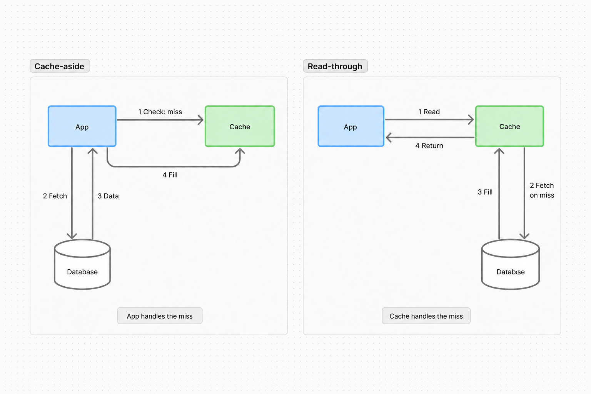

Q: What's the latency downside of cache-aside?
A: A miss adds a cache lookup before the DB read.

Q: Who fetches from the backend on a miss: cache-aside vs. read-through?
A: Cache-aside: application. Read-through: cache layer, which stores and returns the result.

Q: Why is a CDN a useful example of read-through caching?
A: On a miss, the CDN fetches from the origin, caches the response, and serves it.

Q: What's the usual invalidation sequence for a cache-aside write?
A: Commit the DB write, then delete the cached key.

Q: Why can cache-aside still serve stale data after invalidation?
A: A concurrent cache fill can restore old data; invalidation can also fail.

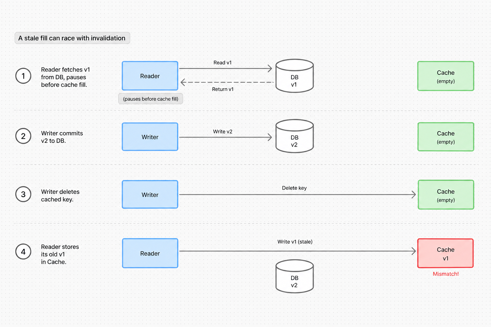

Q: What should happen if Redis goes down in cache-aside?
A: Fall back to DB, with circuit breakers, rate limits, or degraded service to protect it.

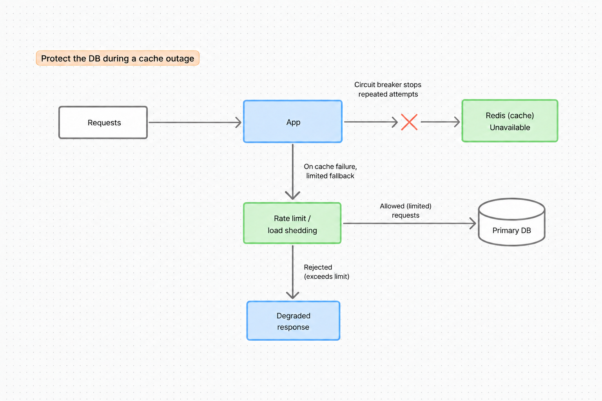

Q: What's write-through caching?
A: Write through the cache layer; acknowledge success only after cache and DB are updated synchronously.

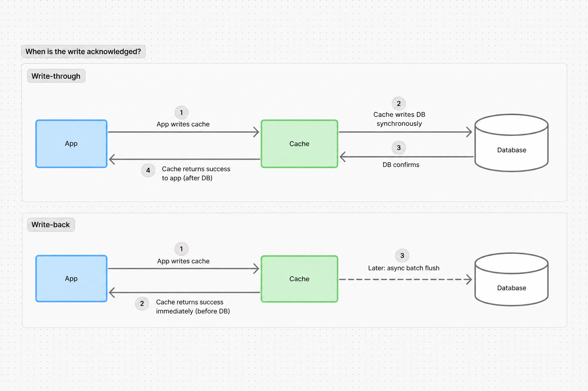

Q: What are the main downsides of write-through caching?
A: Slower writes, caching rarely read data, and partial failures between the two writes.

Q: When is write-through caching useful?
A: When reads need updated cached data after writes and slower writes are acceptable.

Q: What must hold for write-through to keep cached reads fresh?
A: Relevant writes must use the same path; concurrent updates and partial failures need coordination.

Q: What's write-back (write-behind) caching?
A: Acknowledge the cache write, then asynchronously batch and flush writes to DB.

Q: What's the main benefit of write-back caching?
A: Fast writes, with batched DB updates.

Q: What's the main durability risk of write-back caching?
A: Losing unflushed writes if the cache fails without a recoverable copy.

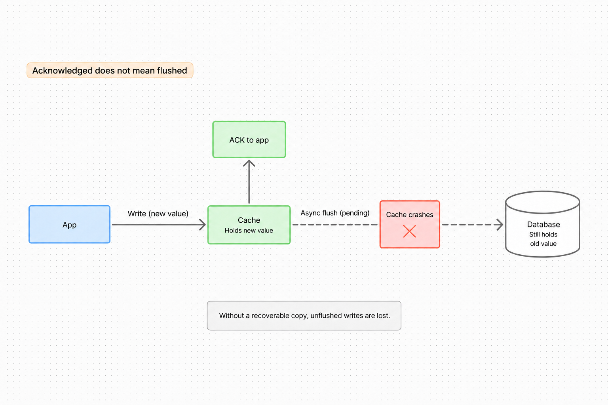

Q: What workload suits write-back caching when unflushed writes aren't durable?
A: High write throughput where occasional data loss is acceptable.

Q: What changes on a write in cache key versioning?
A: The version in the key; new reads use the new key instead of deleting the old one.

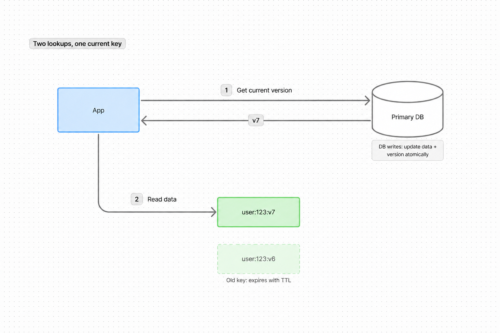

Q: Where should the current version live in a DB-backed cache versioning scheme?
A: In the DB, updated atomically with the data.

Q: Why does DB-backed cache key versioning require two lookups per read?
A: Fetch the current version, then fetch data using that versioned cache key.

Q: How do you avoid replica lag when reading a cache key's current version?
A: Read the version from the primary DB.

Q: Why can a separate version table make version lookups relatively cheap?
A: Indexed primary-key lookups over compact IDs and integers; lookup load still reaches the DB.

Q: Why can old versioned cache entries be left to expire?
A: Readers using the current version won't select them; TTL eventually reclaims them.

Q: What's a cache stampede?
A: Many requests miss the same cached data at once and try to rebuild it from the DB.

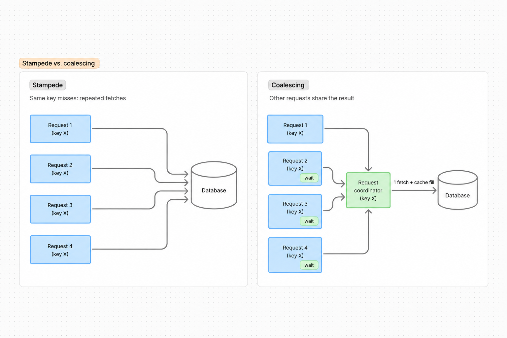

Q: What's request coalescing?
A: One request rebuilds a missing entry; the other N−1 wait for its result.

Q: Which technique turns N concurrent misses for one cache key into one backend fetch?
A: Request coalescing.

Q: What's cache warming?
A: Proactively populate or refresh entries before requests arrive or TTL expires.

Q: What are three ways to mitigate hot cache keys?
A:
- Replicate hot keys and spread reads across replicas
- Add an in-process cache
- Rate-limit abusive traffic

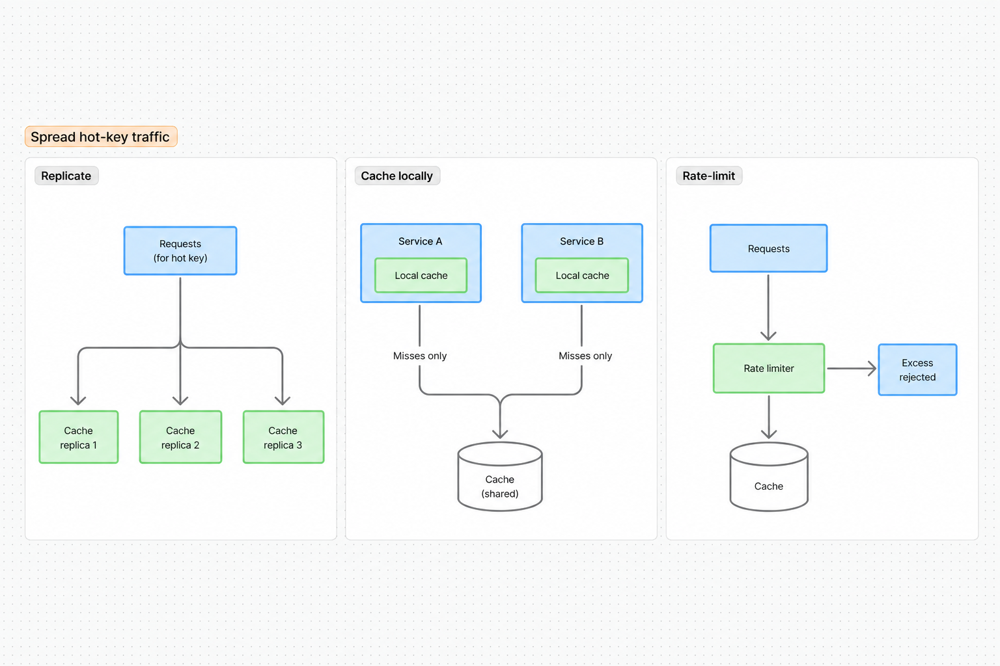

Q: What's client-side caching?
A: Caching on the requester, such as browser HTTP cache, local storage, or mobile app storage.

Q: What's the main backend limitation of client-side caching?
A: Less control over invalidation and forced refresh.

Q: What's in-process caching?
A: Caching directly in the service process's memory.

Q: What data suits in-process caching?
A: Small, frequently read, rarely changing values: feature flags, precomputed values, or hot data.

Q: What's the main consistency limitation of in-process caches across servers?
A: Entries aren't automatically shared, updated, or invalidated across processes.

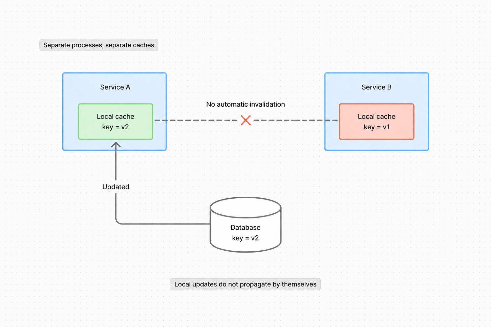

Q: How does a CDN reduce content-delivery latency?
A: Serve cached content from an edge near the user instead of a distant origin.

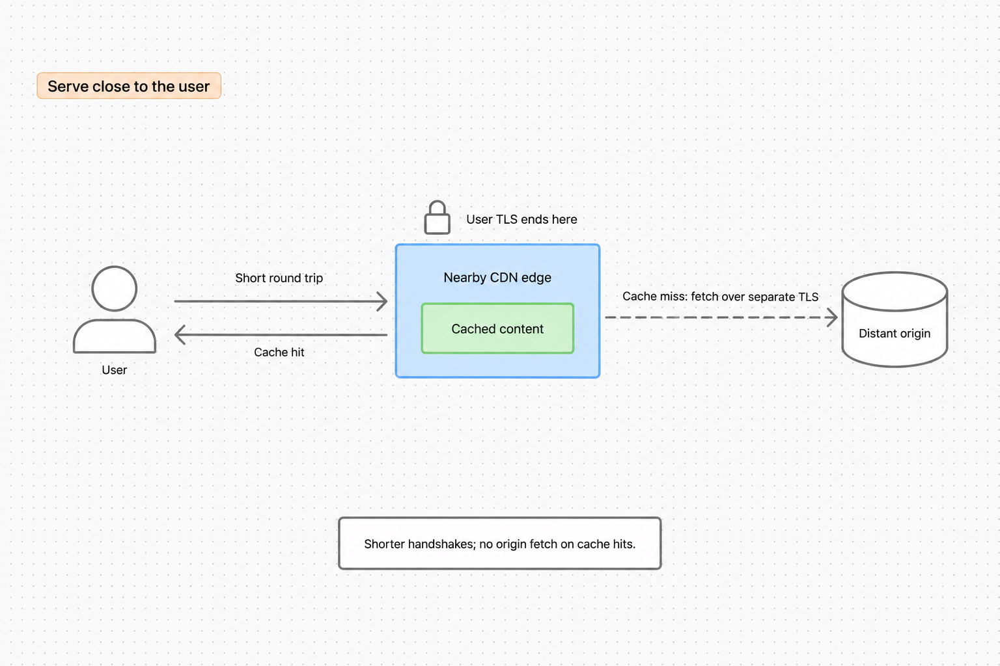

Q: What content is the safest starting point for CDN caching?
A: Public static assets: images, video, CSS, and other public files.

Q: What does terminating TLS at the edge mean, and why can it reduce latency?
A: A nearby edge handles the user's TLS connection, shortening handshake round trips. Savings depend on distance and connection reuse.

Q: What does a cache entry's TTL specify?
A: How long it remains valid before expiring; physical removal may happen later.

Q: When are short TTLs a reasonable consistency strategy?
A: When some staleness is acceptable and simple eventual refresh is preferred.

Q: What problem do cache eviction policies solve?
A: Decide which entries to remove when cache space is limited.

Q: How does TTL differ from a memory-pressure eviction policy?
A: TTL expires entries by time; eviction policies choose what to remove when space is needed.

Q: Which entry does FIFO evict, and what's its weakness?
A: Oldest inserted entry; ignoring usage can evict hot data.

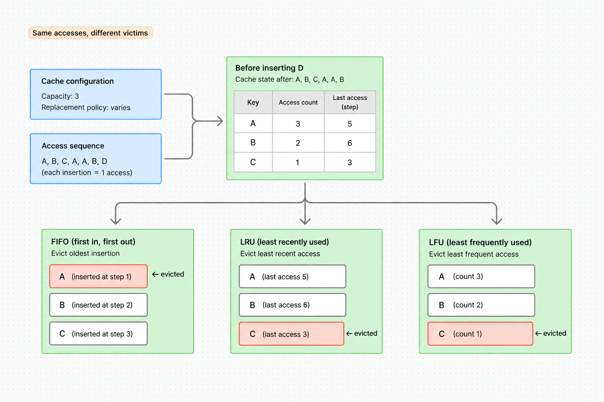

Q: Which entry does LFU evict?
A: The entry with the lowest access frequency.

Q: Which entry does LRU evict?
A: The entry that has gone longest without access.

Q: Which eviction policy tracks recency rather than frequency?
A: LRU; LFU tracks frequency.

Q: When can LFU be preferable to LRU?
A: When the same items remain popular over long periods.

Q: What five decisions should a caching design cover?
A:
1. Bottleneck: latency or backend load
2. Data and keys: what to cache and how to identify it
3. Pattern: cache-aside, read-through, write-through, or write-back
4. Expiration and eviction: freshness and space
5. Failures: stale data, stampedes, hot keys, and outages
