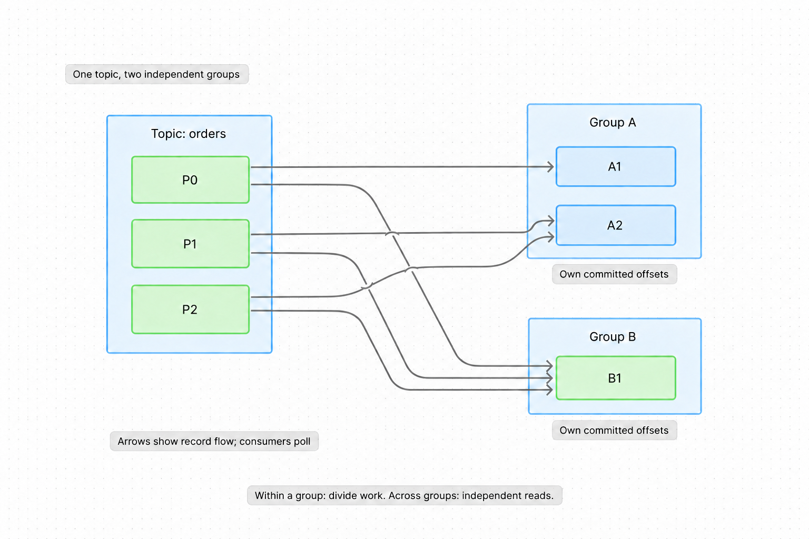
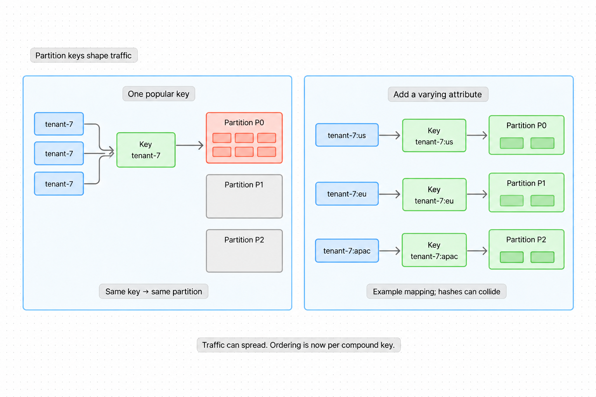
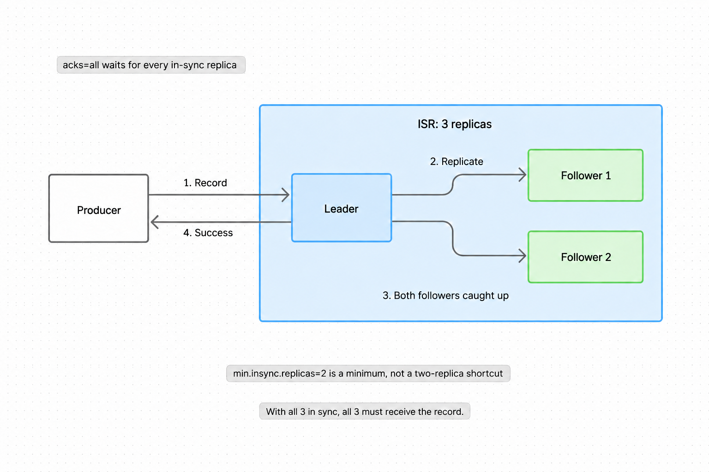
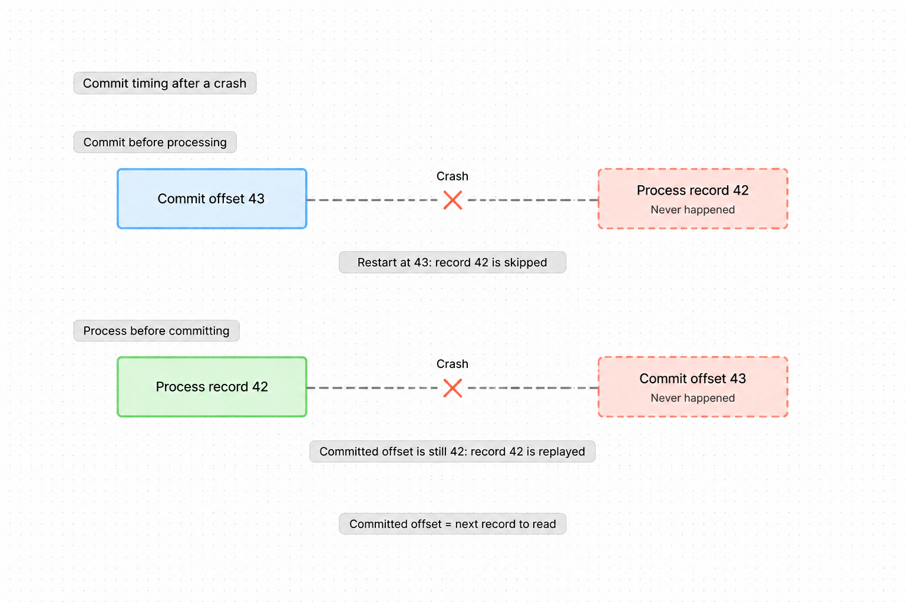

Q: Across different kafka consumer groups, how many groups can consume the same topic-partition?
A: Many groups. Each group maintains its own independent offset.

Q: Do Kafka consumer groups automatically retry failed application processing?
A: No. Use application retries, retry topics, or dead-letter routing.

Q: With Kafka's delete retention policy, what makes old log segments eligible for removal?
A: Time or size limits.

Q: What does Kafka log compaction remove?
A: Older values for the same key, preserving the latest value unless deleted.

Q: How can a poorly chosen partition key create a hot partition in kafka?
A: Many records share one popular key, so they all reach the same partition.

Q: What's one solution for hot partitions in kafka?
A: Compound keys.

Q: How can compound keys reduce hot partitions?
A: Add a varying attribute to spread one entity's traffic across partitions.

Q: How do kafka consumers use offsets?
A: Record progress; restart from committed offsets.

C: A Kafka consumer commits the offset of the [next record to read].

Q: When should a Kafka consumer commit offsets to avoid skipping unfinished work after a crash?
A: After durable processing.

Q: What does an idempotent Kafka consumer protect against?
A: Duplicate side effects when a record is processed again.

Q: Where can a Kafka consumer send a record that repeatedly fails processing?
A: A dead-letter topic.

Q: Before choosing Kafka's partition count, what load should you estimate?
A: Peak write rate and required consumer parallelism.

Q: How does adding brokers scale kafka?
A: Adds storage and serving capacity once partitions are distributed onto them.

Q: How does batching improve kafka performance?
A: Amortizes network and protocol overhead.

Q: How does compression improve Kafka performance?
A: Fewer bytes on the network and disk.

C: Kafka compression saves bandwidth and storage at the cost of [CPU work].

Q: How does partition replication protect Kafka records from a broker failure?
A: Other brokers retain copies.

Q: With `acks=all`, which Kafka setting specifies the minimum required in-sync replica count?
A: `min.insync.replicas`.

Q: Why can `acks=all` with `min.insync.replicas=1` still leave only one copy of a record?
A: The leader may be the only in-sync replica.

Q: With default keyed partitioning, how does Kafka's Java producer choose a partition?
A: Nonnegative hash of the serialized key, modulo partition count.

Q: How can omitting keys help avoid a hot partition in Kafka?
A: One popular entity no longer pins all its records to one partition.

Q: How do you roughly estimate Kafka storage for retained data, including replicas?
A: Stored byte rate × retention time × replication factor.

C: Adding consumers within a Kafka consumer group can increase [parallelism], up to the partition count.

C: Adding Kafka [consumer groups] lets independent jobs read the same topic separately.

Q: How does one Kafka consumer group act like a work queue?
A: Consumers divide the partitions among themselves.

Q: What makes Kafka's retained log useful as an event stream?
A: Independent consumers can replay past events.

Q: Two common roles kafka plays in distributed systems?
A: Message queue or event stream / distributed commit log.

Q: What bounds useful consumer parallelism for one topic within one kafka consumer group?
A: Number of partitions.

Q: What can go wrong if related ordered events are randomly spread across kafka partitions?
A: Consumers may observe the events out of order.

Q: Which four compression codecs does Kafka support?
A: Gzip, Snappy, LZ4, and Zstd.

Q: What determines ordering inside a kafka partition?
A: Offsets. Consumers read based on append order.

Q: With Kafka `acks=all` and `min.insync.replicas=2`, what happens if only one replica is in sync?
A: Writes fail rather than succeed with only one in-sync copy.

C: A Kafka replication factor of 3 means one leader and [two followers] per partition.

Q: What does an idempotent kafka producer protect against?
A: Duplicate messages caused by producer retries for the same send attempt.

Q: By default, how does Kafka 4.1's Java producer partition records without keys?
A: Sticky partitioning: accumulate a batch before switching partitions.

Q: What does kafka's controller manage?
A: Cluster metadata and leadership changes.

Q: What does producer setting `acks=all` mean?
A: Producer receives ack only after all in-sync replicas have received the record.

Q: What does leader replica do in kafka?
A: Handles writes for the partition and usually serves reads.

Q: With Kafka's process-then-commit pattern, what crash causes duplicate processing?
A: A crash after processing but before committing the offset.

Q: What fields can a kafka record contain?
A: Headers / Key / Value / Timestamp.

Q: What happens if there are more consumers than partitions in a kafka consumer group?
A: The extra consumers sit idle.

Q: What happens when a consumer in kafka consumer group fails?
A: Rebalances partitions among remaining consumers.

C: Kafka's Java producer uses [Murmur2] for default key hashing.

Q: What's a kafka consumer group?
A: Consumers sharing a group ID that divide topic partitions.

Q: Can one consumer in a Kafka consumer group handle multiple partitions?
A: Yes.

Q: What's a kafka offset?
A: `id` representing a record's position within a partition.

Q: What's an in-sync replica in kafka?
A: A replica keeping up with the leader within the configured lag limit.

Q: What's a hot partition in kafka?
A: A partition receiving disproportionate traffic, becoming the topic's bottleneck.

C: Kafka stores partition data in [append-only logs].

Q: What's kafka's consumer model: push or pull?
A: Pull based: consumers poll brokers at a rate they control.

Q: What's kafka's replication model for partitions?
A: Leader–follower: one leader and zero or more followers.

Q: What is random salting for kafka partition keys?
A: Adding a random salt so one entity's records can reach multiple partitions.

Q: What's a Kafka topic?
A: A named stream of records, split into partitions.

Q: What's a Kafka partition?
A: An ordered log containing part of a topic.

Q: How does salting Kafka keys affect per-entity ordering?
A: An entity's records may span partitions, losing a single guaranteed order.

Q: Why does salting Kafka keys complicate per-entity aggregation?
A: Results for one entity must be combined across partitions.

Q: What is the durability trade off of weaker kafka producer acks?
A: Higher throughput at the risk of message loss.

Q: Why use an entity ID as a Kafka record key?
A: To keep that entity's records in one partition for ordered reads.

Q: Main downside of sending kafka records without keys?
A: Losing per-entity ordering.

Q: What's the preferred pattern for using kafka with large files?
A: Store large files in blob storage; put their location/ID in kafka messages.

Q: What's the role of kafka record headers?
A: Carry metadata as KV pairs similar to HTTP headers.

Q: How should you estimate per-broker Kafka throughput for capacity planning?
A: Benchmark your workload on the target hardware.

Q: What message size guideline is useful for kafka in system design?
A: Keep messages under 1 MB.

Q: What ordering guarantee does kafka provide?
A: Messages are ordered within a partition, not across partitions.

Q: If Kafka traffic is skewed, what should you inspect before tuning small settings?
A: The partition key distribution.

Q: What does producer backpressure do when Kafka cannot keep up?
A: Slows or blocks incoming production to limit queued work.

Q: What trade off comes with increasing kafka retention?
A: Longer replay window and higher storage cost.

Q: What can go wrong if a Kafka consumer commits before processing a record?
A: A crash can leave the record unprocessed but skipped on restart.

Q: What can go wrong if a Kafka consumer delays committing after processing?
A: A crash can cause already-processed records to be replayed.

Q: When might SQS suit a work queue better than Kafka consumer groups?
A: When you want managed message redelivery and dead-letter queues.

Q: How does Kafka decouple a producer from a temporarily slow consumer?
A: The retained log buffers records while the consumer catches up.

Q: Why are partitions central to kafka scalability?
A: Spread a topic's data across brokers for parallel consumption.

Q: Why does `acks=all` improve kafka durability?
A: Reduces chance of an ack'd message disappearing after leader failover.

Q: Why does append only design help kafka perf?
A: Sequential disk I/O instead of scattered writes.

Q: Why does kafka use pull based consumer model?
A: Consumers control their own consumption rate.

Q: Why can adding Kafka brokers leave a hot partition bottlenecked?
A: That partition's writes still pass through one leader.

Q: After adding Kafka brokers, how do you move existing topic load onto them?
A: Reassign partitions and balance leaders onto the new brokers.

Q: Why should kafka consumers do small units of work?
A: Less work to redo after a crash before committing offsets.

Q: Within one kafka consumer group, how many consumers can actively consume the same topic-partition?
A: At most one.

C: [Partitions] are kafka's unit of parallelism and ordering.
